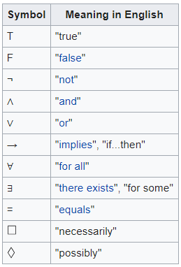
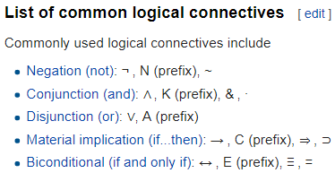

Logical symbols
- Logical constants
  - Logical connectives
  - Quantifiers
- Variables

a logical constant is a symbol that has the same semantic value under every interpretation. 

Two important types of logical constants are logical connectives and quantifiers. The equality predicate (usually written '=') is also treated as a logical constant in many systems of logic.

