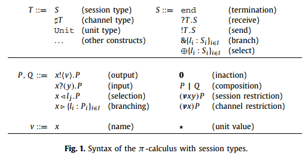
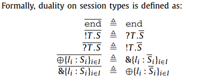

## Session types

Session types are a rich type discipline, based on linear types.

session types in Links, Scribble, and Singularity OS.

We formulate a typed formalism for concurrency where types denote freely composable structure of dyadic interaction in the symmetric scheme.

===

Session types are a formalism used to model structured communication-based programming. A binary session type describes communication by specifying the type and direction of data exchanged between two parties. 

In complex distributed systems, participants willing to communicate should previously agree on a protocol to follow. The specified protocol describes the types of messages that are exchanged as well as their direction. In this context session types came into play: they describe a protocol as a type abstraction. 

Session types are defined as a sequence of input and output operations, explicitly indicating the types of messages being transmitted. This structured sequentiality of operations is what makes session types suitable to model protocols. However, they offer more flexibility than just performing inputs and outputs: they also permit internal and external choice.

### Duality
In session types theory, duality plays a central role: a session is identified by two channel endpoints, and these must have dual types. 

Indeed, in the encoding, dual session types (e.g., the branch type and the select type) are mapped onto the same type (e.g., the variant type). In general, dual session types will be mapped onto linear types that are identical except for the outermost I/O tag — duality on session types boils down to the opposite input and output capabilities of channels.

???
Session types were originally designed for process calculi.
When session types and session processes are added to the syntax of standard π-calculus

▻ ◅

The selection process *x◅Lj.P* on *x* selects label *Lj* and proceeds as process *P*.

The branching process *x▻{Li:Pi},i∈I* on *x* offers a range of alternatives each labelled with a different label ranging over the index set *I*. According to the selected label *Lj* the process *Pj* will be executed.

*(νxy)P* is the session restriction construct; it creates a session channel, more precisely its two endpoints *x* and *y* and binds them in *P*. The two endpoints should be distinguished to validate subject reduction.

15
29
16

? 31

dedicated 14 12 23
